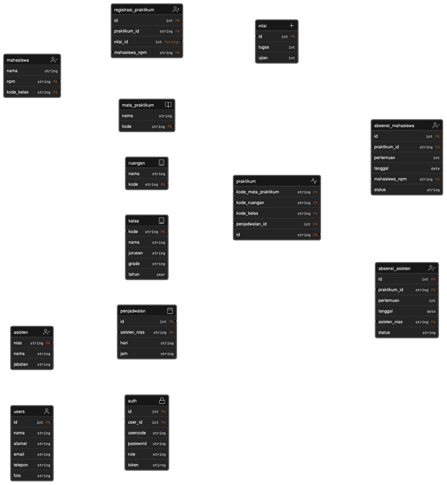

<div align="center">

```
GENESYS
Genetics System for Laboratorium
```

</div>

### Tujuan
Dibuat untuk memenuhi tugas Mini Project MSIB di Alterra Academy

---

### Deskripsi
GeneSys merupakan sebuah sistem berbasis RESTful API yang dirancang untuk membantu dalam pelaksanaan kegiatan praktikum di lingkungan kampus, seperti penjadwalan kegiatan praktikum, absensi praktikum, sampai penilaian praktikum.

---

### Entity-Relationship Diagram

<div align="center">
   <a href="https://app.eraser.io/workspace/Z5kbBvtArXogo1aQ27sz">
      
   </a>
</div>

---

### Tech Stack

| KATEGORI       | NAMA                                |
|----------------|-------------------------------------|
| Framework      | ECHO                                |
| ORM Library    | GORM                                |
| Database       | MySQL                               |
| Code Structure | Clean Architecture                  |
| Authentication | JSON Web Token                      |
| Deployment     | AWS EC2                             |
| Unit Testing   | >= 80%                              |
| Fitur Tambahan | Pagination, Searching, Upload Image |
